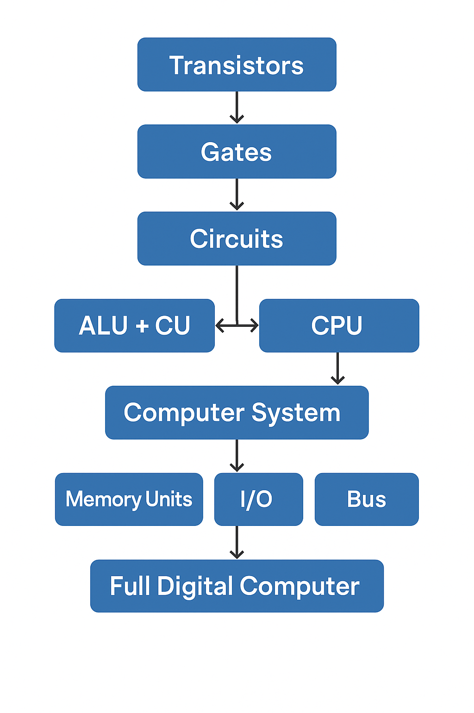

# Building Blocks of a Digital Computer

A digital computer is like a house made of many small bricks. Those **"bricks"** are built layer-by-layer — from tiny electronics (like transistors) to complex systems (like software). Here's a simple breakdown:

---

## 1. Transistors

* The **smallest building block**.
* Tiny **electronic switches** (ON/OFF).
* Billions of them are inside every computer chip.

---

## 2. Logic Gates

* Made using transistors.
* Perform **basic logical operations** like:

  * **NOT** (Inverter)
  * **AND**, **OR**, **NAND**, **NOR**, **XOR**
* These gates form the **digital logic**.

Example: A **NAND gate** gives output 0 **only when** both inputs are 1.

---

## 3. Combinational Circuits

* Made by combining logic gates.
* Output depends **only on current input**.
* Examples:

  * **Adders** (to add numbers)
  * **Multiplexers**
  * **Decoders**

---

## 4. Sequential Circuits

* These use **memory** (can remember past input).
* Output depends on **current input + previous state**.
* Examples:

  * **Flip-Flops**
  * **Registers**
  * **Counters**

---

## 5. Memory Units

* Store **data** and **instructions**.
* Types:

  * **RAM (Random Access Memory)** – temporary storage
  * **ROM (Read-Only Memory)** – permanent instructions
  * **Cache, Hard Drive, SSDs**

---

## 6. Arithmetic Logic Unit (ALU)

* Does **math** (addition, subtraction, etc.)
* Performs **logic operations** (AND, OR, NOT)

---

## 7. Control Unit

* **Brain of the CPU**.
* Controls **what happens when**.
* Tells other parts: "Do this now, wait, go next..."

---

## 8. CPU (Central Processing Unit)

* Made of:

  * **ALU**
  * **Control Unit**
  * **Registers**
* It is the **main processing engine**.

---

## 9. Input/Output Devices (I/O)

* Input: Keyboard, Mouse, Mic
* Output: Monitor, Printer, Speaker

---

## 10. System Bus

* The **communication path** between CPU, memory, and I/O devices.
* Types:

  * **Data Bus** (moves data)
  * **Address Bus** (locates memory)
  * **Control Bus** (carries commands)

---

## Diagram:

